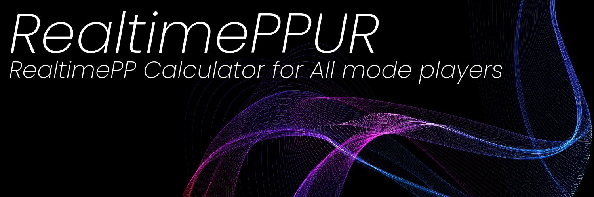

# RealtimePPUR    
This software will tell you how much the offset is off, with real-time PP, UR, in the osu game.

# Features
- **PP, UR and SR displayed in real time**
  > * Calculate SR, PP and UR in real time and display them on the software and on the InGameOverlay!

- **InGameOverlay that can display various information such as PP, SR, Hits, etc.**
  > * InGameOverlay (in-game overlay) that can be customized in various ways!
  > * Since it does not use injector, it does not violate the terms of osu!

- **Function to open other people's replay screens to see their PP**!
  > * Function to calculate and display IFFC, SSPP, SR, and PP when you open someone else's result in ranking, etc. **Function to see PP when you open someone else's result in ranking**, etc!

- **Complete conversion support**
  > * Complete support for conversion of all Modes, so even converters can use it with confidence!

- **Lightweight!**
  > * Memory optimization has been done so that it is much lighter than the previous RealtimePPUR!

- **All Modes supported**
  > * This software is fully compatible with all Modes!

# How to launch RealtimePPUR?
Simply launch RealtimePPUR.exe, the icon with the blue, PP.

# About IngameOverlay

## Values
1: SR → SR: 〇〇 / 〇〇

2: SSPP → SSPP: 〇〇pp

3: CurrentPP → PP: 〇〇pp

4: CurrentACC → ACC: 〇〇 / 〇〇%

5: Hits → Hits: 〇〇/〇〇/〇〇/〇〇

6: IFFCHits → IFFCHits: 〇〇/〇〇/〇〇/〇〇

7: UR → UR: \(CurrentUR\)

8: OffsetHelp → Offset: 〇〇

9: AVGOFFSET → AvgOffset: 〇〇

10: HealthPercentage → HP: 〇〇%

11: UserScore → Score: 〇〇

12: Remaining Notes → Notes: 〇〇〇〇

# Credit

Joystick icons created by Us and Up - Flaticon

Software UI Design Based - Gosumemory, Tosu -> Ingame2 by Dartandr(https://github.com/Dartandr)
